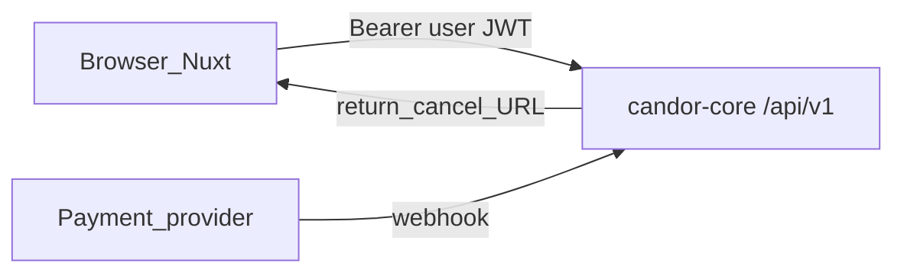
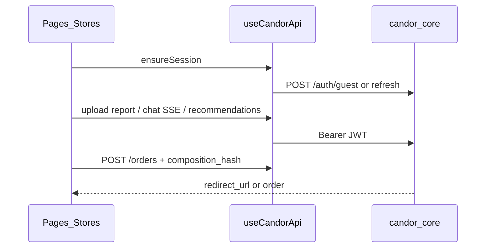

# 01 — 系統架構

## 高層架構

Browser／Nuxt **直連** candor-core，不經產品 BFF。細節見 [candor-core docs/05](https://github.com/DaydreamLab/candor-core/blob/main/docs/05-integration-architecture.md)。

## 模組邊界

| 模組 | 職責 | 不可做 |
|------|------|--------|
| **pages／layouts／components** | 路由、版面、呈現 | 自算建議分數、竄改 ClaimGuard |
| **stores**（auth／journey／orders） | session、旅程草稿、訂單列表快取 | 把 token 寫進 URL；用售價重排建議 |
| **composables/useCandorApi** | `$fetch`、Bearer、envelope、SSE | 新增 Nitro mock 當正式後端 |
| **utils/candor-api** | DTO／錯誤型別／token 鍵常數 | 定義與 OpenAPI 相反的欄位語意 |
| **middleware** | auth／chat-layout | 伺服端假裝已登入（token 僅 client） |
| **server/api/*** | 殘留 demo／記憶體 mock | **新功能禁止擴充**；退役見 roadmap M5 |
| **i18n** | 繁中／EN 文案 | 用翻譯鍵當 API 識別子 |

## 資料流（主路徑）

## 狀態存放

| 鍵／位置 | 內容 |
|----------|------|
| `localStorage` `candor.guest.token` | user JWT（guest／member） |
| `localStorage` `candor.unpaid.journey` | 未完成旅程草稿（conversation 等） |
| Pinia `auth`／`journey`／`orders` | 執行期狀態；auth 以 token 為準 |

## 環境

| 變數 | 說明 |
|------|------|
| `NUXT_PUBLIC_API_BASE` | core 公開 API 根（預設 `http://localhost:8080/api/v1`） |

CORS 由 core 的 `CORS_ALLOWED_ORIGINS` 放行本機 `http://localhost:3000` 等 origin。

## 與 core 文件分工

| 文件 | 範圍 |
|------|------|
| candor-core `01`／spec／ADR | 引擎、DB、金流內部 |
| candor-core `05`／`31` | 直連、auth、SSE、必接端點 |
| **本檔** | 本 app 模組與 mock 邊界 |

## 相關

- 總覽：[00-overview.md](00-overview.md)
- 進度：[03-progress.md](03-progress.md)
- 畫面：[spec/10-screens.md](spec/10-screens.md)
- Client：[spec/11-api-client.md](spec/11-api-client.md)
